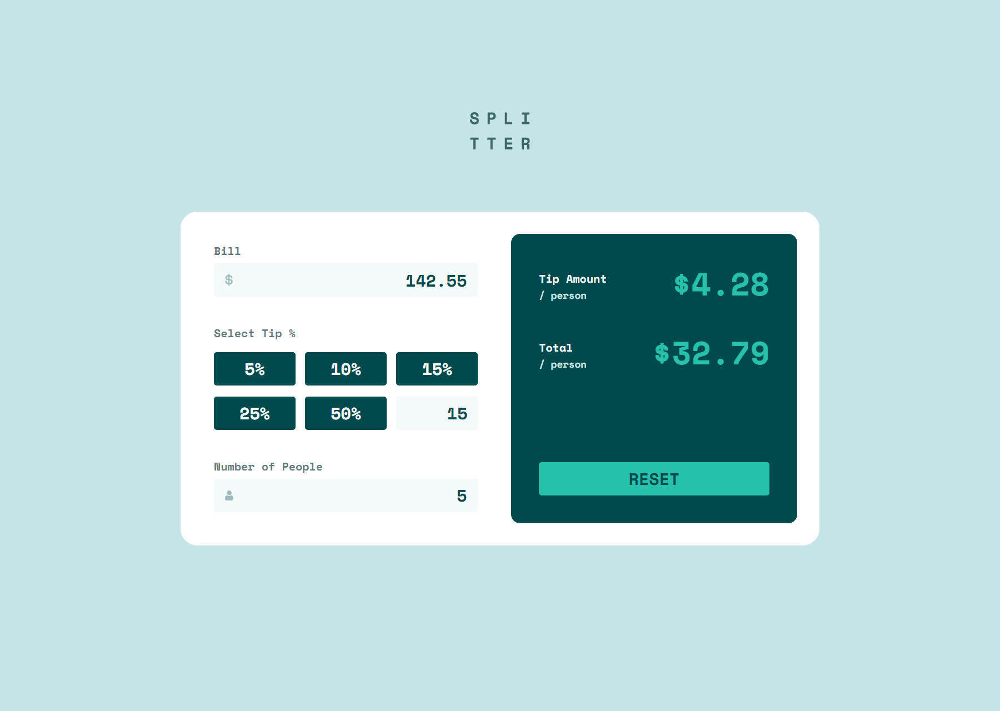

# Frontend Mentor - Tip calculator app solution

This is a solution to the [Tip calculator app challenge on Frontend Mentor](https://www.frontendmentor.io/challenges/tip-calculator-app-ugJNGbJUX). Frontend Mentor challenges help you improve your coding skills by building realistic projects.

## Table of contents

- [The challenge](#the-challenge)
- [Screenshot](#screenshot)
- [Links](#links)
- [Useful resources](#useful-resources)
- [Author](#author)

## The challenge

Users should be able to:

- View the optimal layout for the app depending on their device's screen size
- See hover states for all interactive elements on the page
- Calculate the correct tip and total cost of the bill per person

## Screenshot

## Links

- Solution URL: [GitHub Repository](https://github.com/joangute/tip-calculator/)
- Live Site URL: [GitHub Pages](https://joangute.github.io/tip-calculator/)

## Useful resources

- [MDN Web Docs](https://developer.mozilla.org/) - This helped me to remember some javascript functions.

## Author

- Frontend Mentor - [@joangute](https://www.frontendmentor.io/profile/joangute)